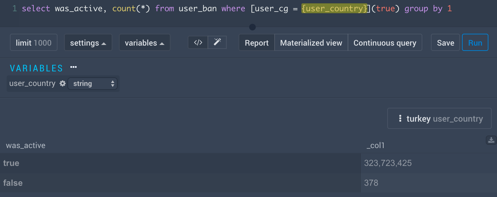
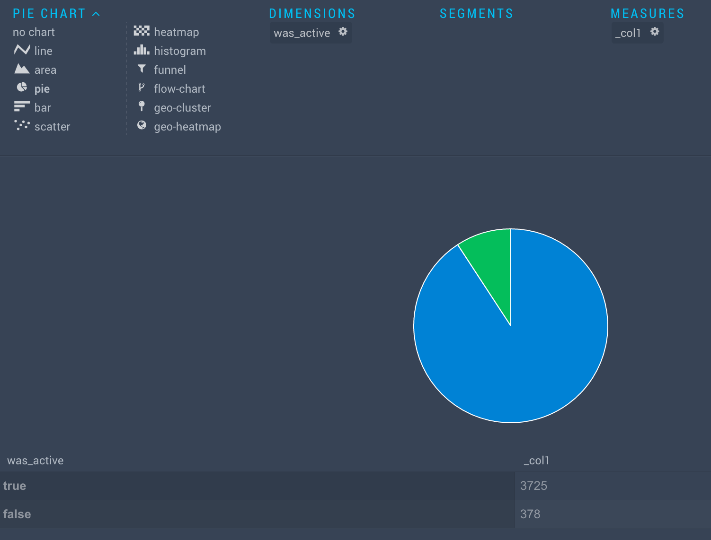

You can access the reports page using the file icon in sidebar, here is the direct link for the page: [http://app.rakam.io/reports](http://app.rakam.io/reports)

You can generate the reports using the plus button in top of the sidebar of the reports page. It will redirect you to the playground page that you can write SQL queries, run them on the fly and visualize the results using charts, add parameters to your SQL queries and save them as reports.

## Simple Query Editor

You can generate SQL queries with a simple interface using the magic button placed in action bar. It basically allows you to generate simple SQL queries similar this format `SELECT key, aggregation_function(value) FROM table GROUP BY key ORDER BY 2 DESC`. It's quite useful because you can switch the SQL editor from this mode whenever you want. Start constructing your SQL query with simple GUI-based query editor and switch to advanced SQL editor if you need.

## SQL Editor

You can write your custom SQL queries using the SQL editor in playground page. The schema of the tables will appear in sidebar of the playground page. You can also learn how the schemas work in [this page](/buremba/rakam-wiki/master/Analyze-Data).

The SQL syntax is based on PrestoDB SQL syntax which is based on ANSI SQL. Therefore, if you're familiar with any other RDBMS such as MySQL or Oracle database, the learning curve is pretty low. If you're familiar with Postgresql, the syntax is quite similar since PrestoDB SQL syntax is mainly influenced by Postgresql. You can find the documentation [here](https://prestodb.io/docs/current/).

When you're ready to run the query, press the `Run` button, Rakam will send the query directly to your Rakam API which will stream the results directly to your browser so Rakam BI won't be able to see the query that you executed and the result you get. We have a dedicated page for security [here](/buremba/rakam-wiki/master/Rakam-BI/Security).

## SQL Parameters

You can use dynamic parameters in your SQL queries. This feature is basically implemented by the web application and works similar to template engines. You place parameters in your query similar to `WHERE [user_cg = {user_country}](true)`, choose the type of the dynamic parameter `user_country` as string and the possible values of the parameter cog icon as shown in the picture below. Rakam BI will automatically draw a dropdown on top the report, when you click a value in dropdown the SQL query will be compiled and executed via your Rakam API. The compiled SQL query will be `WHERE user_cg = 'turkey'` if the value `turkey` is selected, otherwise it will be `WHERE true`. The syntax is pretty simple, it's just `WHERE [EXPRESSION_THAT_WILL_BE_COMPILED](FALLBACK_VALUE_IF_A_VALUE_IS_NOT_SELECTED)`. You can define a dynamic parameter via `{user_country}`, if it's in the part `EXPRESSION_THAT_WILL_BE_COMPILED`, the parameter will be optional. If you write type parameter not enclosed with `[]`, `WHERE user_cg = {user_country}`, the parameter will be required. That's all.

We have a few parameter types such as `string`, `date` and `date-range`. 
> date-range exposes an array with to elements which incluces start date and end data. You can use it similar to `WHERE _time between {date[0]} and {date[1]}`.
> The values of string parameters can be static or dynamic values that can indicate the table names, column names or the values of SQL queries. You can select the options with cog icon placed near the variable tab.

## Charts

Rakam supports various charts as shown in the picture below. You can turn data to charts and modify them depending on your needs. When you select a chart type, its options will be appeared.

## Table configs

The data table is dynamic a customizable, you can format the column values, specify the column height (useful if you render images as column values), add statistics in data tables etc.

## Reports & Continuous Queries & Materialized views

You can create reports using playground page but this page is also used for creating continuous queries and materialized views. The mode of the playground page can be selected using the button group placed in action bar. Note that dynamic variables are supported only in report mode and charts and data tables can only be used as demonstration when the mode is continuous queries and materialized views.

